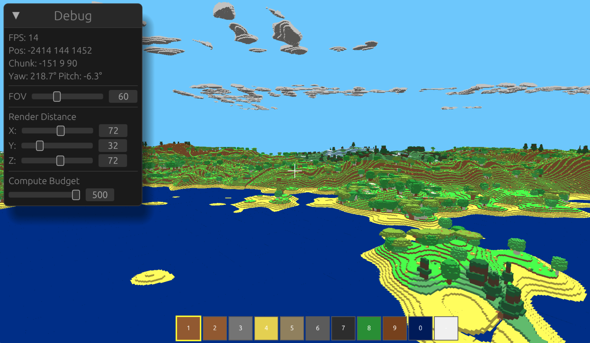

# woxel – Voxel-based Game Engine in Rust

A voxel-based Minecraft-style game engine built with **Rust**, **wgpu**, and **WebAssembly**, featuring both web and native desktop support.



## Features

✨ **Core Gameplay**
- First-person voxel exploration and building
- Infinite procedurally generated terrain with biome system (Tundra, Mountain, Forest, Desert, Beach, Ocean)
- Cave generation with 3D noise-based carving
- Water, cloud systems, and dynamic block types
- Tree placement and vegetation

🎮 **Graphics**
- GPU-accelerated rendering using **wgpu** (cross-platform graphics API)
- Efficient chunk-based rendering with mesh generation
- Outline/selection system for block editing
- Depth-based shadows and proper lighting

🌐 **Platform Support**
- **Web**: Play directly in browser via WebAssembly (Trunk)
- **Native**: Desktop application (Windows, macOS, Linux)
- Unified codebase with clean MVC architecture

⚙️ **Architecture**
- **Model**: Game state, terrain, chunk management
- **View**: GPU rendering pipeline, shader management
- **Controller**: Input handling, physics, game loop
- Shared core logic across platforms

## Quick Start

### Prerequisites
- **Rust** 1.70+ ([Install](https://rustup.rs/))
- **For Web**: [Trunk](https://trunkrs.io/) and [wasm-pack](https://rustwasm.org/wasm-pack/)
- **For Native**: Standard Rust toolchain

### Web (WASM)

```bash
# Install Trunk (one-time)
cargo install trunk

# Run in dev mode with hot-reload
trunk serve

# Build optimized WASM
trunk build --release
```

**Open**: http://localhost:8080 (dev) or check `dist/` folder (release)

### Native Desktop

```bash
# Run natively
cargo run --release

# Or build standalone binary
cargo build --release
# Binary: target/release/woxel (or .exe on Windows)
```

## Project Structure

```
src/
├── model/              # Game state & data (MVC Model)
│   ├── world/          # Voxels, blocks, chunks, terrain generation
│   ├── camera.rs       # Camera position/orientation
│   └── scene.rs        # World scene management
│
├── view/               # Rendering pipeline (MVC View)
│   ├── render.rs       # wgpu rendering, pipelines
│   ├── gpu_init.rs     # GPU device/surface setup
│   └── shaders/        # WGSL shader files
│
├── controller/         # Game logic & input (MVC Controller)
│   ├── frame_loop.rs   # Main game update loop
│   ├── camera_controller.rs # Player movement control
│   ├── physics.rs      # Gravity, collision detection
│   └── input.rs        # Input event handling
│
├── lib.rs              # WASM entry point
├── main.rs             # Native entry point
└── utils.rs            # Helper functions
```

## Controls

| Action | Key | Mouse |
|--------|-----|-------|
| Move Forward | W | - |
| Move Back | S | - |
| Strafe Left | A | - |
| Strafe Right | D | - |
| Jump | Space | - |
| Look Around | - | Mouse Movement |
| Place Block | - | Right Click |
| Remove Block | - | Left Click |
| Toggle UI | F1 | - |

## Configuration

- **Chunk Size**: 16×16×256 blocks (configurable in `model/world/chunk.rs`)
- **Render Distance**: Dynamic (depends on GPU capability)
- **Terrain Generation**: Perlin/FBM noise-based (see `model/world/terrain.rs`)

## Building for Release

### Web
```bash
trunk build --release
# Output: dist/
```

### Native
```bash
cargo build --release
# Output: target/release/woxel
```

## Development

### Useful Commands

```bash
# Check code without building
cargo check

# Run tests
cargo test

# Format code
cargo fmt

# Lint with Clippy
cargo clippy

# Debug web build
trunk serve  # Then open DevTools (F12)

# Profile native build
cargo build --release && time ./target/release/woxel
```

### Adding Features

1. **New Block Type**: Edit `model/world/block.rs`
2. **Terrain Generation**: Modify `model/world/terrain.rs`
3. **Rendering Changes**: Update `view/render.rs` or shaders
4. **Game Logic**: Add to `controller/` modules

## Performance Notes

- ✅ GPU-driven rendering (minimal CPU bottleneck)
- ✅ Efficient chunk streaming with async loading
- ✅ Mesh generation caching per chunk
- ⚠️ Current: ~60 FPS on mid-range hardware
- 🔄 TODO: LOD (Level of Detail) for distant chunks

## Known Limitations

- 🚧 Multiplayer: Single-player only
- 🚧 Saving/Loading: In-memory only (no persistence)
- 🚧 Advanced Physics: Basic gravity & collision
- 🚧 Sound: No audio system yet
- ⚙️ Mobile: Not optimized for touch controls

## Technology Stack

| Component | Technology |
|-----------|------------|
| Graphics | [wgpu](https://github.com/gfx-rs/wgpu) |
| Math | [glam](https://github.com/bitshifter/glam-rs) |
| GUI | [egui](https://github.com/emilk/egui) |
| Web Bundle | [Trunk](https://trunkrs.io/) |
| Desktop Window | [winit](https://github.com/rust-windowing/winit) |
| Noise | Custom Perlin/FBM implementation |

## Contributing

Contributions welcome! Areas needing help:
- 🎨 Improved textures & block models
- 🌍 Biome diversity improvements
- ⚡ Performance optimizations (LOD, culling)
- 🐛 Bug fixes and edge cases
- 📚 Documentation improvements

## License

This project is licensed under [MIT License](LICENSE) – feel free to use it for personal or commercial projects.

## Acknowledgments

- Minecraft for inspiration
- wgpu community for excellent documentation
- Rust gamedev ecosystem

## Status

**Current Phase**: Early Development

- ✅ Basic voxel rendering and interaction
- ✅ Procedural terrain generation
- ✅ Cross-platform (Web + Native)
- 🚧 Performance optimization
- 🚧 Feature expansion (biome variety, entities, etc.)

---

Built with ❤️ in Rust